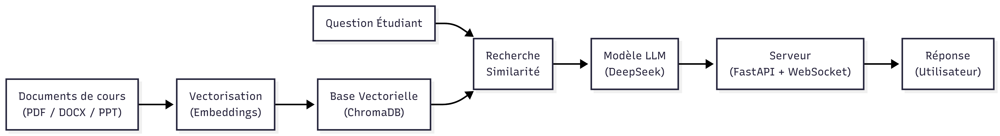

# HYBRAG-Hybrid-AI-Chatbot-DeepSeekR1-Ollama-
# 🤖 HYBRAG
## Hybrid RAG Chatbot powered by DeepSeek R1 & Ollama

HYBRAG est un **chatbot intelligent basé sur une approche hybride**, combinant la **génération de texte par un modèle de langage (LLM)** et la **recherche sémantique dans des documents** grâce au **RAG (Retrieval-Augmented Generation)**.

L’objectif du projet est de fournir des réponses **fiables, contextualisées et basées sur des documents réels**, particulièrement adaptées à un **contexte académique**.

---

## ✨ Fonctionnalités

- 🔐 Création de compte et connexion utilisateur
- 📄 Upload de documents pédagogiques (PDF, DOCX, PPT)
- 🧠 Indexation intelligente des documents (RAG)
- 🔍 Recherche sémantique dans une base vectorielle
- 💬 Chat interactif avec historique
- 📚 Réponses basées sur les documents (avec sources optionnelles)
- ⚡ Génération de réponses en streaming

---

## 🧠 Approche Hybride (LLM + RAG)

HYBRAG ne repose pas uniquement sur un modèle de langage.

Il combine :
- **DeepSeek R1** pour la génération de réponses
- **Un moteur de recherche documentaire** basé sur des embeddings

Cette approche hybride permet de :
- réduire les hallucinations du modèle
- améliorer la pertinence des réponses
- garantir un lien direct avec les documents fournis

---

## 🏗️ Architecture Globale



---

## 📄 Pipeline d’Indexation des Documents

1. Upload du fichier par l’utilisateur
2. Détection du type de fichier (PDF / DOCX / PPT)
3. Extraction du texte brut
4. Découpage en chunks  
   - Taille : **1000 caractères**
   - Overlap : **200 caractères**
5. Génération des embeddings avec **Ollama**
6. Stockage dans **ChromaDB**
7. Indexation et sauvegarde

---

## ❓ Pipeline Question / Réponse (RAG)

1. L’utilisateur pose une question
2. Détection des questions simples (smalltalk)
3. Recherche sémantique dans ChromaDB
4. Filtrage par score de pertinence
5. Construction du contexte (Top-K chunks)
6. Génération de la réponse par DeepSeek R1
7. Retour de la réponse en streaming

---

## 🧰 Technologies Utilisées

### Backend
- **FastAPI** (Python)
- WebSocket (chat temps réel)

### Frontend
- HTML
- CSS
- JavaScript

### Intelligence Artificielle
- **DeepSeek R1** (LLM)
- **Ollama** (embeddings)
- **ChromaDB** (base vectorielle)
- RAG (Retrieval-Augmented Generation)

### Données
- Base de données relationnelle (utilisateurs, conversations)
- Base vectorielle (documents indexés)

---

## 🚀 Lancer le Projet

```bash
# Créer un environnement virtuel
python -m venv venv
source venv/bin/activate  # Windows : venv\Scripts\activate

# Installer les dépendances
pip install -r requirements.txt

# Lancer le backend
uvicorn main:app --reload


